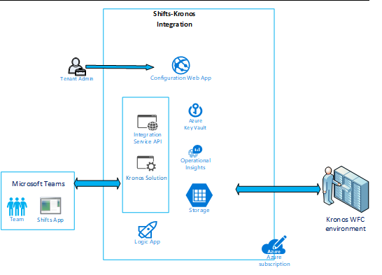

# Deployment Guide

## Overview
This document is created to help IT Administrators to deploy, configure, and use the **Shifts-Kronos Integration application** in a Microsoft Azure environment.  
**Kronos Workforce Central (Kronos WFC 8.1)** is a Workforce Management system designed for First Line Managers (FLMs) and First Line Workers (FLWs). Kronos provides various capabilities to handle schedules of FLWs in organizations with multiple dpeartments and job categories. First Line Workers can access their schedule, create schedule requests for Time-Offs, Open Shifts, Swap Shifts, etc.. FLMs can create, and access their FLWs' schedules, schedule requests and approve those.  
**Shifts App in Microsoft Teams** keeps FLWs connector and in sync. It's built mobile first for fast and effective time management and communication for teams. Shifts lets FLWs and FLMs use their mobile devices to manage schedules and keep in touch.  
**Shifts-Kronos Integration application** is built to sync data between Kronos Workforce Central (v8.1) and Microsoft Shifts App in Teams in seamless fashion. It helps FLWs access their schedules which are created in Kronos system from Shifts App, and further enables FLMs to access schedule requests which are created in Shifts from Kronos system.

## Considerations
The points noted below are to be considered as best practices to properly leverage the full potential of the Shifts-Kronos Integration application.

•	IT Admin has functional understating of Kronos WFC 8.1 and Microsoft Teams Shifts App. IT Admin is also the super user of Kronos – The IT Admin needs to have admin-level access to Shifts as their credentials are required for request approval  
•	Kronos WFC serves as single source of truth for all entities  
•	Shifts App is used by FLWs to view their schedules, create requests for Time-Offs, Open-Shifts, Swap-Shifts  
•	FLMs will use Kronos WFC only for all Approval/Rejection workflows  
•	FLW requests (Open Shift Request, Swap Shift Request) will be sync’d from Shifts to Kronos in synchronous manner using Shifts Outbound APIs and Kronos WFC 8.1 data submission (POST) APIs  
•	FLW requests for Time Off will be sync’d from Shifts to Kronos in asynchronous manner  
•	Approved schedules for Shifts, Time-Offs, Open-Shifts and Swap-Shifts will be sync’d from Kronos to Shifts in asynchronous manner using Kronos WFC 8.1 GET APIs and Shifts/Graph post APIs  
•	Status of requests created in Shifts App and synced to Kronos WFC will be synced back to Shifts to keep both systems in sync  
•	To sync all the requests initiated in Shifts (by FLWs) to Kronos, SuperUser account credentials are used. Once these are approved in Kronos (by FLMs), their approval status will be synced back to Shifts. These statuses are synced to Shifts using Microsoft Graph APIs with Shifts Admin account authorization  
•	Users must be created in Azure/Teams prior to User to User mapping step to be performed in Configuration Web App (Config Web App is one of the components of this integration as explained in below sections)  
•	Teams and Scheduling groups must be created in Shifts prior Teams to Department mapping step in Configuration Web App  
•	Done button on Configuration Web App should be used only for first time sync  
•	First time sync is expected to take longer time since it may sync data for larger time interval. The time would vary based on amount of data i.e. number of users, number of teams, number of entities (such as Shifts, TimeOffs, OpenShifts etc.) to be synced and date span of the Time interval for which the sync is happening. So, it may take time to reflect this complete data in Shifts. Done button click will initiate background process to complete the sync  

## Solution Overview
The Shifts-Kronos Integration application has the following components built using ASP.Net Core 2.2. Those need to be hosted on Microsoft Azure.
•	Configuration Web App  
•	Integration Service API  
•	Azure Logic App for periodic data sync  
•	Kronos WFC solution to retrieve data and post data, part of Integration Service API  

# Legal notice

Please read the license terms applicable to this [license](https://github.com/OfficeDev/Microsoft-Teams-Shifts-WFM-Connectors/blob/master/LICENSE). In addition to these terms, you agree to the following: 

* You are responsible for complying with all applicable privacy and security regulations, as well as all internal privacy and security policies of your company. You must also include your own privacy statement and terms of use for your app if you choose to deploy or share it broadly. 

* This template includes functionality to provide your company employees with HR information, and it is your responsibility to ensure the data is presented accurately. 

* Use and handling of any personal data collected by your app is your responsibility. Microsoft will not have any access to data collected through your app, and therefore is not responsible for any data related incidents.

# Contributing

This project welcomes contributions and suggestions. Most contributions require you to agree to a Contributor License Agreement (CLA) declaring that you have the right to, and actually do, grant us the rights to use your contribution. For details, visit https://cla.opensource.microsoft.com. 

When you submit a pull request, a CLA bot will automatically determine whether you need to provide a CLA and decorate the PR appropriately (e.g., status check, comment). Simply follow the instructions provided by the bot. You will only need to do this once across all repos using our CLA. 

This project has adopted the [Microsoft Open Source Code of Conduct](https://opensource.microsoft.com/codeofconduct/). For more information see the [Code of Conduct FAQ](https://opensource.microsoft.com/codeofconduct/faq/) or contact opencode@microsoft.com with any additional questions or comments. 

 